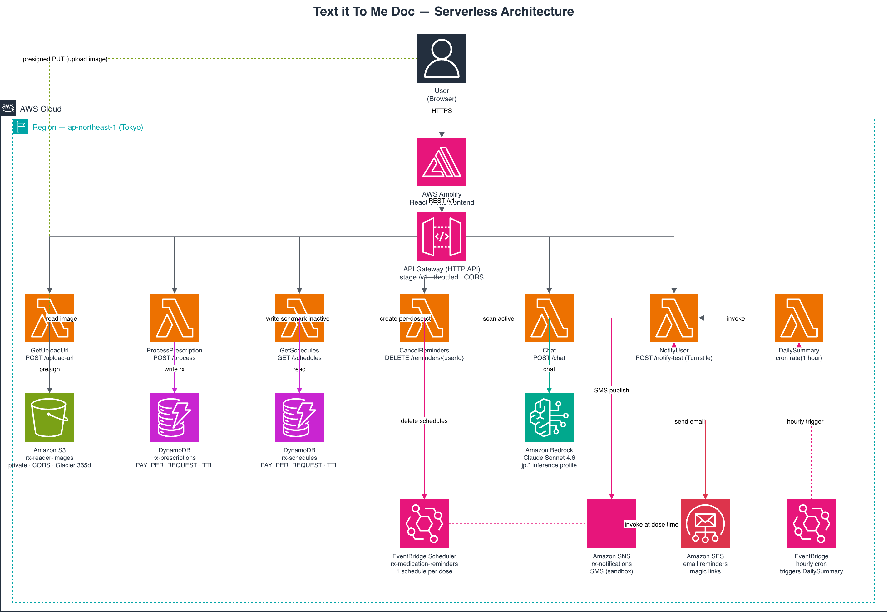

# Text it To Me Doc — Serverless Prescription Reader

A medication-reminder app hosted as a Vite/React static site on AWS Amplify, with an AWS SAM (Lambda + API Gateway) backend that reads handwritten prescriptions through Amazon Bedrock, builds a dose schedule, and sends reminders by SMS and email.

## Project Structure

```text
text-it-to-me-doc-app/
├── frontend/                       # Vite + React static frontend (hosted on Amplify)
│   ├── index.html                  # Vite entry HTML
│   ├── src/
│   │   ├── main.jsx                # React bootstrap
│   │   ├── App.jsx                 # Main UI (upload, schedule view, AI chat drawer)
│   │   └── Icons.jsx               # Custom SVG icon set
│   ├── vite.config.js              # Vite config (build output → dist/)
│   └── package.json
├── backend/
│   └── functions/                  # One folder per Lambda (handler = index.js)
│       ├── getUploadUrl/           # Returns a presigned S3 PUT URL
│       ├── processPrescription/    # Bedrock vision → schedule → DynamoDB + Scheduler
│       ├── notifyUser/             # Sends one reminder via SNS (SMS) or SES (email)
│       ├── cancelReminders/        # Cancels all upcoming reminders for a user (opt-out)
│       ├── dailySummary/           # Hourly cron → today's-meds summary
│       ├── getSchedules/           # Returns the user's active schedules
│       └── chat/                   # Bedrock medication Q&A with guardrails
├── template.yaml                   # SAM template — every AWS resource lives here
├── samconfig.toml                  # SAM deploy config (stack name, region, parameters)
├── amplify.yml                     # Amplify static-site build spec (appRoot: frontend)
├── DEPLOY.md                       # Step-by-step deployment runbook
└── README.md
```

## Architecture



> Every box above (except Amplify) is defined as code in `template.yaml` and deployed as one unit via `sam deploy` — the deployed CloudFormation stack `text-it-to-me-doc` in `ap-northeast-1`.

## How The App Works

1. The user opens the Amplify-hosted site and either tries **demo mode** (a built-in sample prescription) or uploads 1-5 photos/screenshots of a real prescription.
2. For a real upload, the frontend creates one `uploadId`, then calls `POST /upload-url` once per page and receives a short-lived presigned S3 URL plus an `imageKey`.
3. The browser `PUT`s each image directly to S3 using those URLs, so the images never pass through Lambda or API Gateway payload limits.
4. The frontend calls `POST /process` with `imageKeys`, `uploadId`, a local browser profile ID, timezone, notification method, and contact info. `uploadId` is used as an idempotency key so repeat submissions of the same upload do not create duplicate reminder schedules.
5. `ProcessPrescription` first records a DynamoDB processing lock, then fetches the images from S3 and sends them together to Amazon Bedrock, which returns the medications and dose times as structured JSON.
6. The Lambda stores the prescription and schedule in DynamoDB, then creates one EventBridge Scheduler rule per future dose (each fires once and auto-deletes).
7. At each dose time, the Scheduler invokes `NotifyUser`, which sends an SMS (SNS) or email (SES) reminder for that dose — this is **Option A**, exact per-dose reminders.
8. Independently, an hourly EventBridge cron invokes `DailySummary`, which scans active schedules and, when it is morning in the user's timezone, calls `NotifyUser` with a "today's medications" summary — this is **Option B**.
9. `GET /schedules` returns the user's active schedules so the frontend can render the current timetable. Restore links can request inactive schedules too, allowing the app to show a friendly cancelled-schedule state.
10. `POST /chat` answers medication questions about the current prescription, with guardrails that refuse dose changes, diagnoses, and off-topic questions.
11. `DELETE /reminders/{userId}` cancels all upcoming reminders. The `CancelReminders` Lambda queries DynamoDB for all active schedule records, deletes each linked EventBridge Scheduler rule by name, and marks every record inactive so `DailySummary` skips the user. Rules that have already fired are ignored. The frontend exposes this as a **Stop reminders** button in the reminder details panel.

### Where Uploaded Prescriptions Are Stored

Prescription images are stored in the private S3 bucket created by the SAM stack:

```text
rx-reader-images-441342223857
```

The browser does not upload images through Lambda. Instead, `GetUploadUrl` creates short-lived presigned S3 `PUT` URLs, and the browser uploads each image directly to S3:

```text
Browser
    → POST /upload-url
    → GetUploadUrl Lambda
    → presigned S3 PUT URL
    → Browser uploads each image directly to S3
```

Multi-page uploads are grouped under one S3 prefix:

```text
<userId>/prescriptions/<uploadId>/page-1.jpg
<userId>/prescriptions/<uploadId>/page-2.jpg
<userId>/prescriptions/<uploadId>/page-3.jpg
```

After upload, `ProcessPrescription` reads the image(s) from S3 and sends up to 5 pages to Bedrock Claude in one request for extraction.

### S3 Bucket Security

Prescription images are sensitive medical data. The bucket is locked down at multiple layers:

| Control | Setting | Effect |
|---|---|---|
| Block Public Access | All four flags enabled | No object can ever be made public, even if a policy or ACL tries to allow it |
| CORS | `AllowedOrigins: [Amplify URL only]` | Only the Amplify-hosted frontend can initiate presigned PUT uploads from a browser |
| Presigned URLs | Short-lived PUT-only URLs issued by `GetUploadUrl` | The browser uploads directly to S3 without any credentials; the URL expires after one use |
| Lambda access | `S3ReadPolicy` on `ProcessPrescription`, `S3WritePolicy` on `GetUploadUrl` | No other Lambda or IAM principal has access to the bucket |
| Lifecycle rule | Transitions to Glacier after 365 days | Old images move to cold storage automatically; no permanent hot-storage copy |

There is no public S3 URL for any prescription image. The only way to read an image is through the `ProcessPrescription` Lambda, which reads it via an AWS SDK call using its execution role — not a public URL. A lifecycle rule moves images older than one year to Glacier storage for cheaper long-term retention.

### AI Model Roles

The application uses Anthropic's **Claude Sonnet 4.6**, accessed through Amazon Bedrock (`jp.anthropic.claude-sonnet-4-6`, a Japan-resident inference profile), for two distinct jobs:

- **Prescription reading (vision).** `ProcessPrescription` sends the prescription image to the model with a strict extraction prompt. The model expands shorthand (`bid`, `tid`, `pc`, `q6h`, ditto marks, tapers) into explicit per-dose dates and times and returns JSON only.
- **Medication chat (text).** `Chat` answers questions grounded in the current prescription. The system prompt forbids dose changes, diagnosis, and off-topic answers, and redirects emergencies to call emergency services.

A single SAM parameter, `BedrockModelId`, sets the model for both functions, so the model must be **vision-capable**. The `jp.` profile keeps inference within Japan, which is preferable to the `global.` profile for medical images.

### Bedrock Access: IAM, Not API Keys

The frontend does **not** call Claude or Bedrock directly. The browser calls API Gateway, API Gateway invokes Lambda, and Lambda calls Amazon Bedrock using its AWS execution role:

```text
Amplify React app
    → API Gateway
    → Lambda
    → Amazon Bedrock
    → Claude model
```

This means there is no `ANTHROPIC_API_KEY`, `OPENAI_API_KEY`, or `VITE_ANTHROPIC_KEY` required in production. Bedrock access is controlled by AWS IAM instead of an external API key. The Lambda execution role is granted:

```yaml
Action:
  - bedrock:InvokeModel
  - bedrock:InvokeModelWithResponseStream
```

So the security question is: "Does this Lambda role have permission to invoke this Bedrock model?" The model itself is selected by `BEDROCK_MODEL_ID`, which comes from the SAM parameter `BedrockModelId`.

In short:

```text
Direct Anthropic API  = API key
Claude through Bedrock = AWS IAM role permission
```

## AWS Services In This Project

### What Is AWS SAM?

The AWS Serverless Application Model (SAM) is an infrastructure-as-code layer on top of CloudFormation. `template.yaml` declares the Lambdas, API Gateway, DynamoDB tables, S3 bucket, SNS topic, IAM roles, and EventBridge schedules. `sam build` packages each function's dependencies and `sam deploy` creates or updates the whole stack as one unit.

In this project, SAM manages the **entire backend**. This is the main difference from a manually uploaded Lambda: there is no separate `aws lambda update-function-code` step — a backend change is `sam build && sam deploy`.

### What Is AWS Amplify?

AWS Amplify Hosting is used here only as a static web host and Git-based deployment target. It watches the connected GitHub branch, runs `amplify.yml`, and publishes the Vite build output (`frontend/dist/`).

Amplify does **not** manage the SAM backend. It only builds and hosts the frontend.

### What Is API Gateway?

Amazon API Gateway is the public HTTPS entry point for the backend. Browsers cannot safely call Lambda directly, so API Gateway exposes a URL such as:

```text
https://dr4auuv5p7.execute-api.ap-northeast-1.amazonaws.com/v1
```

It receives requests from the frontend, handles CORS preflight, and routes each path to its Lambda.

### Why Use API Gateway?

API Gateway gives the frontend one stable public URL while the Lambdas stay behind AWS-managed integrations. For this app:

```text
Frontend fetch() -> API Gateway POST /process -> ProcessPrescription Lambda
```

## Deployment

This project has two separate deployment paths:

```text
Git push           -> Amplify deploys frontend/dist/
sam build & deploy -> CloudFormation updates the backend stack
```

This is important: changing files in `backend/` or `template.yaml` and pushing to GitHub does **not** update the live backend. Only `sam deploy` does. Likewise, running `sam deploy` does not change the website — only an Amplify build does.

### GitHub Commits And Amplify Deployments

Amplify is connected to the GitHub repository branch. When a commit is pushed, Amplify checks out the new commit, runs `amplify.yml`, and publishes the build artifact. Because `amplify.yml` publishes only `frontend/`, only changes that affect that artifact change the deployed website.

| Commit/change type | Amplify build triggered? | Live frontend changes? |
|---|---:|---:|
| `frontend/src/App.jsx`, `frontend/index.html` | Yes | Yes |
| `amplify.yml` | Yes | Yes, build behavior may change |
| `README.md` only | Yes | No |
| `backend/**` or `template.yaml` only | Yes | No, backend is not deployed by Amplify |
| Documentation-only commit | Yes | No functional change |

So the mental model is:

```text
GitHub push -> Amplify notices commit -> Amplify builds frontend/
```

This is separate from:

```text
sam build -> sam deploy -> CloudFormation updates the backend stack
```

### Frontend: Amplify Deployment

Amplify is configured by `amplify.yml`:

```yaml
version: 1
applications:
  - appRoot: frontend
    frontend:
      phases:
        preBuild:
          commands:
            - npm ci
        build:
          commands:
            - npm run build
      artifacts:
        baseDirectory: dist
        files:
          - '**/*'
      cache:
        paths:
          - node_modules/**/*
```

Vite outputs to `dist/`, so `baseDirectory` is `dist`, not `build`.

Required Amplify environment variable:

```text
VITE_API_BASE_URL=https://dr4auuv5p7.execute-api.ap-northeast-1.amazonaws.com/v1
```

Required for the production **Send test notification** button:

```text
VITE_TURNSTILE_SITE_KEY=<Cloudflare Turnstile site key>
```

When this is set, the **Send test notification** button renders a Cloudflare Turnstile check and sends the resulting token to `/notify-test`.

Do **not** set `VITE_ANTHROPIC_KEY` in Amplify. That variable only enables a local-preview chat path; production chat goes through the `/chat` Lambda.

### Backend: SAM Deployment

Deploy the backend after changing anything under `backend/` or `template.yaml`:

```bash
sam build
sam deploy
```

`samconfig.toml` already stores the stack name, region, capabilities, and parameter overrides, so plain `sam deploy` is non-interactive apart from the changeset confirmation. The first ever deploy can use `sam deploy --guided`; at each prompt that shows a value in brackets, press **Enter** to accept it (typing `y` replaces the value with the literal string `y`).

### When You Need To Redeploy

| Change | Redeploy needed |
|---|---|
| Edit a Lambda's `index.js` or add a dependency | `sam build && sam deploy` |
| Add or change a resource in `template.yaml` | `sam build && sam deploy` |
| Change a SAM parameter value (model, sender email) | `sam deploy` with new `--parameter-overrides` (or edit `samconfig.toml`) |
| Edit the frontend | Git push (Amplify rebuilds) |
| Edit `README.md` or `DEPLOY.md` | Nothing functional changes |

### Learning Note: SAM Backend Versus Manual Lambda Upload

A manually uploaded Lambda backend separates code upload (`aws lambda update-function-code`) from configuration. A SAM backend folds both into one CloudFormation operation: `sam deploy` diffs the template against the live stack and applies only what changed. The trade-off is that the deployment unit is the whole stack, not a single function — which is why a backend change here is one command rather than per-function uploads.

## Backend Parameters

Set in `template.yaml` (defaults) and overridable at deploy time in `samconfig.toml`:

```text
BedrockModelId=jp.anthropic.claude-sonnet-4-6   # vision-capable Bedrock inference profile
SesFromEmail=noreply@jaycloud.net               # verified SES sender address
TurnstileSecretKey=<secret>                      # Cloudflare Turnstile secret for /notify-test
```

Each Lambda also receives environment variables from the SAM `Globals` block — `PRESCRIPTIONS_TABLE`, `SCHEDULES_TABLE`, `IMAGES_BUCKET`, `BEDROCK_MODEL_ID`, `SCHEDULER_GROUP`, `SNS_TOPIC_ARN` — plus per-function values (`NOTIFIER_FUNCTION_ARN`, `SCHEDULER_ROLE_ARN`, `SES_FROM_EMAIL`, `TURNSTILE_SECRET_KEY`). `NOTIFIER_FUNCTION_ARN` and `SCHEDULER_ROLE_ARN` are deliberately set per-function rather than in `Globals` to avoid a circular dependency on `NotifyUserFunction`.

## DynamoDB Tables

Two PAY_PER_REQUEST tables are created by the template:

| Table | Keys | Purpose |
|---|---|---|
| `rx-prescriptions` | `userId` (HASH), `prescriptionId` (RANGE) | The parsed prescription returned by Bedrock |
| `rx-schedules` | `userId` (HASH), `scheduleId` (RANGE) | The dose schedule used by `GetSchedules` and `DailySummary` |

Both enable TTL on the `expiresAt` attribute, so records auto-delete one year after creation. `GetSchedules` queries by `userId` and filters on `active = true`.

## Notifications: SES Email And SNS SMS

`NotifyUser` sends one reminder per invocation, choosing the channel from `notificationMethod` (`"sms"` or `"email"`).

The frontend reminder details panel also has a **Send test notification** button. It calls:

```text
POST /notify-test
```

That route invokes the same `NotifyUser` Lambda with `type: "test"`, so you can verify the selected email address or phone number immediately before waiting for a scheduled medication reminder. The public test route requires a valid Cloudflare Turnstile token; scheduled reminders, daily summaries, and server-side subscription confirmation emails do not use this public path.

**Email (SES).** The sender is the verified `SesFromEmail`. The `jaycloud.net` domain is verified in `ap-northeast-1`, so any `@jaycloud.net` address works as a sender. Confirm production access:

```bash
aws sesv2 get-account --region ap-northeast-1
```

```json
"ProductionAccessEnabled": true
```

When production access is enabled, SES can send to any recipient; in sandbox it can send only to verified addresses.

**SMS (SNS).** `NotifyUser` uses SNS direct publish to a phone number in E.164 format (`+639XXXXXXXXX`) as a `Transactional` message. New accounts start in the **SNS SMS sandbox**, which only delivers to verified destination numbers. Before testing real SMS:

1. SNS console → Text messaging (SMS) → add and verify a destination number (enter the OTP).
2. Set a monthly spend limit (for example `$1`) as a cost guardrail.

Check sandbox status:

```bash
aws sns get-sms-sandbox-account-status --region ap-northeast-1
```

Philippines (+63) delivery is carrier-dependent — test with your own number first.

Supported timezone presets in the UI include Manila, London, Tokyo, Edmonton, Kuala Lumpur, Vietnam, Sweden, Poland, Dubai, Germany, New York, and Los Angeles. These are stored as IANA timezone IDs such as `America/Edmonton`, `Asia/Kuala_Lumpur`, and `Europe/Berlin`.

### Opting Out Of Reminders

Users can cancel all upcoming reminders at any time directly from the app:

1. Open the **Reminder Details** panel (below the prescription upload card).
2. Click **Stop reminders**.
3. The app calls `DELETE /reminders/{userId}`, which:
   - Queries `rx-schedules` for all active schedule records belonging to that browser profile.
   - Deletes every linked EventBridge Scheduler rule by name — so no future dose notifications will fire.
   - Marks each schedule record `active: false` and `processingStatus: cancelled` in DynamoDB, so the hourly `DailySummary` cron also skips this user.
4. A confirmation message is shown inline once the cancellation completes. If the user later opens an old schedule link, the app explains that the schedule was cancelled and offers a new upload path.

**What opt-out does not cover:**
- Doses whose Scheduler rules have already fired (those reminders have already been sent and the rules auto-deleted).
- Re-uploading a new prescription will create fresh Scheduler rules from that point forward.

There is no bulk-marketing or broadcast messaging in this app. Each user manages their own contact details and reminder schedule entirely within their browser session.

## API Gateway Routes

The HTTP API (`RxApi`) is created by SAM with stage `v1`. Routes:

```text
POST   /upload-url         -> GetUploadUrl
POST   /process            -> ProcessPrescription
GET    /schedules          -> GetSchedules
DELETE /reminders/{userId} -> CancelReminders
POST   /notify-test        -> NotifyUser (immediate smoke test)
POST   /chat               -> Chat
```

`DailySummary` has no HTTP route — it is triggered by an hourly EventBridge cron. `NotifyUser` is invoked by EventBridge Scheduler for each dose and via `/notify-test` for smoke tests.

Smoke-test the deployed API without the app:

```bash
API="https://dr4auuv5p7.execute-api.ap-northeast-1.amazonaws.com/v1"
curl -s -X POST "$API/chat" \
  -H "Content-Type: application/json" \
  -d '{"message":"What is amoxicillin for?","prescription":{"medications":[{"name":"amoxicillin","dose_mg":500}]}}'
```

A JSON `{ "reply": "..." }` confirms API Gateway, the Chat Lambda, and Bedrock all work.

## Local Development

Run the frontend dev server:

```bash
cd frontend
npm install
npm run dev
```

Open:

```text
http://localhost:5173
```

Without `VITE_API_BASE_URL`, the app runs in demo mode (the sample prescription). To exercise the deployed backend locally, create `frontend/.env` with:

```text
VITE_API_BASE_URL=https://dr4auuv5p7.execute-api.ap-northeast-1.amazonaws.com/v1
VITE_TURNSTILE_SITE_KEY=<Cloudflare Turnstile site key>
```

---

For troubleshooting common errors, known limitations, and teardown steps, see [TROUBLESHOOTING.md](TROUBLESHOOTING.md).

EOF
